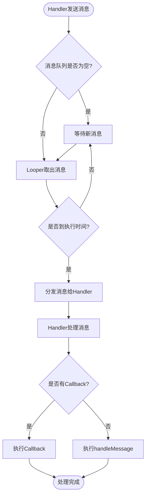

# Android Handler 机制详解

## 目录
1. [Handler 机制是什么](#handler-机制是什么)
2. [为什么需要 Handler](#为什么需要-handler)
3. [Handler 核心组件](#handler-核心组件)
4. [Handler 工作原理](#handler-工作原理)
   - [为什么主线程 Looper 无限循环不会卡住 UI 线程](#为什么主线程-looper-无限循环不会卡住-ui-线程)
5. [如何使用 Handler](#如何使用-handler)
6. [常见使用场景](#常见使用场景)
7. [注意事项和最佳实践](#注意事项和最佳实践)

---

## Handler 机制是什么

**Handler** 是 Android 提供的一种线程间通信机制，主要用于在不同线程之间传递和处理消息。它是 Android 消息机制的核心组件，与 **MessageQueue**（消息队列）和 **Looper**（消息循环器）共同构成了 Android 的消息处理系统。

### 核心概念

Handler 机制基于**生产者-消费者模式**，主要包含以下四个核心组件：

1. **Handler（处理器）**：负责发送和处理消息
2. **Message（消息）**：封装了需要传递的数据和任务
3. **MessageQueue（消息队列）**：存储待处理的消息，按时间顺序排列
4. **Looper（循环器）**：不断从消息队列中取出消息并分发给对应的 Handler

---

## 为什么需要 Handler

### 1. Android 主线程（UI 线程）限制

Android 系统规定，**所有 UI 操作必须在主线程（Main Thread/UI Thread）中执行**。如果在子线程中直接操作 UI，会抛出 `CalledFromWrongThreadException` 异常。

```java
// ❌ 错误示例：在子线程中直接更新 UI
new Thread(() -> {
    textView.setText("Hello"); // 会抛出异常！
}).start();

// ✅ 正确示例：使用 Handler 切换到主线程
new Thread(() -> {
    handler.post(() -> {
        textView.setText("Hello"); // 安全！
    });
}).start();
```

### 2. 线程间通信需求

在 Android 开发中，经常需要在子线程执行耗时操作（如网络请求、文件读写），然后将结果更新到 UI 上。Handler 提供了线程间通信的桥梁。

### 3. 异步任务调度

Handler 支持延迟执行和定时执行任务，可以方便地实现定时器、延迟操作等功能。

### 4. 避免线程安全问题

通过 Handler 机制，所有消息都在同一个线程的消息循环中顺序处理，避免了多线程并发访问 UI 导致的线程安全问题。

---

## Handler 核心组件

### 1. Message（消息）

Message 是消息的载体，包含以下重要字段：

- `what`：消息类型标识（int）
- `arg1`、`arg2`：简单的整型参数
- `obj`：任意对象
- `target`：目标 Handler（由系统设置）
- `when`：消息执行时间（时间戳）

```java
Message msg = Message.obtain();
msg.what = 1;
msg.arg1 = 100;
msg.obj = "数据";
```

### 2. MessageQueue（消息队列）

MessageQueue 是一个按时间排序的优先级队列，使用单链表实现。消息按照 `when` 字段排序，时间早的消息优先处理。

### 3. Looper（循环器）

Looper 负责从 MessageQueue 中取出消息并分发给对应的 Handler。每个线程只能有一个 Looper，主线程的 Looper 由系统自动创建。

### 4. Handler（处理器）

Handler 负责：
- 发送消息到 MessageQueue
- 处理从 Looper 分发的消息

---

## Handler 工作原理

### 整体架构流程图


### 详细工作流程


### 消息处理流程图



### 为什么主线程 Looper 无限循环不会卡住 UI 线程？

这是一个非常关键的问题！很多人会疑惑：如果主线程的 `Looper.loop()` 是一个无限循环，为什么不会导致应用卡死？

#### 核心原理

**Looper 的无限循环是"阻塞式等待"，而不是"忙等待"**。关键在于：

1. **线程会进入等待状态**：当消息队列为空时，线程会进入阻塞状态，**不会占用 CPU 资源**
2. **使用 epoll 机制**：底层使用 Linux 的 `epoll`（I/O 多路复用）机制，线程会挂起等待
3. **有消息时被唤醒**：当有新消息到达时，线程会被唤醒，处理消息后继续等待
4. **消息处理是顺序的**：消息按顺序处理，处理完一条再处理下一条

#### 详细流程


#### 源码分析

让我们看看 `Looper.loop()` 的核心实现（简化版）：

```java
public static void loop() {
    final Looper me = myLooper();
    final MessageQueue queue = me.mQueue;
    
    for (;;) {  // 无限循环
        Message msg = queue.next(); // 关键：这里会阻塞等待
        
        if (msg == null) {
            return; // 退出循环
        }
        
        // 分发消息给 Handler
        msg.target.dispatchMessage(msg);
        
        // 回收消息对象
        msg.recycleUnchecked();
    }
}
```

关键在于 `queue.next()` 方法：

```java
Message next() {
    for (;;) {
        // 1. 尝试从队列中取出消息
        Message msg = mMessages;
        if (msg != null && msg.when <= now) {
            return msg; // 有消息，立即返回
        }
        
        // 2. 没有消息，进入阻塞等待
        nativePollOnce(ptr, nextPollTimeoutMillis);
        // nativePollOnce 是 JNI 调用，底层使用 epoll
        // 线程会在这里挂起，不占用 CPU
    }
}
```

#### 为什么不会卡住？

1. **阻塞等待，不占用 CPU**
   - 当消息队列为空时，`nativePollOnce()` 会让线程进入等待状态
   - 线程被挂起，**不消耗 CPU 资源**
   - 类似于 `Thread.sleep()`，但更高效

2. **事件驱动机制**
   - 线程只在有消息时才被唤醒
   - 处理完消息后立即回到等待状态
   - 这是一个**事件驱动的模型**

3. **消息处理时间短**
   - UI 更新操作通常很快（几毫秒到几十毫秒）
   - 只要消息处理时间不超过 5 秒，就不会出现 ANR
   - 如果处理时间过长，才会导致 UI 卡顿

#### 时间线示例


从时间线可以看出：
- **处理消息时**：线程活跃，执行代码
- **等待消息时**：线程阻塞，**不占用 CPU**

#### 与普通循环的区别

```java
// ❌ 普通忙等待循环（会卡死 UI）
while (true) {
    // 一直占用 CPU，导致 UI 卡死
}

// ✅ Looper 循环（不会卡死）
for (;;) {
    Message msg = queue.next(); // 阻塞等待，不占用 CPU
    msg.target.dispatchMessage(msg);
}
```

#### 什么时候会卡住？

虽然 Looper 循环本身不会卡住，但在以下情况下会导致 UI 卡顿：

1. **消息处理时间过长**
   ```java
   handler.post(() -> {
       // ❌ 耗时操作会阻塞主线程
       Thread.sleep(10000); // 10秒，会导致 ANR
       textView.setText("完成");
   });
   ```

2. **消息队列积压**
   - 如果消息发送速度 > 处理速度
   - 消息会在队列中积压
   - 导致 UI 更新延迟

3. **同步屏障消息过多**
   - 某些系统消息优先级很高
   - 可能导致普通消息延迟处理

#### 总结

主线程的 Looper 无限循环不会卡住 UI 线程，因为：

| 特性 | 说明 |
|------|------|
| **阻塞等待** | 无消息时线程挂起，不占用 CPU |
| **事件驱动** | 有消息时才唤醒处理 |
| **快速处理** | UI 操作通常很快完成 |
| **顺序执行** | 消息按顺序处理，保证线程安全 |

这就像餐厅的服务员：
- **有客人时**：忙碌服务（处理消息）
- **无客人时**：休息等待（阻塞等待）
- **不会一直跑来跑去**（忙等待）

这种设计既保证了消息的及时处理，又避免了不必要的 CPU 消耗，是 Android 消息机制的精妙之处。

---

## 如何使用 Handler

### 1. 基本使用方式

#### 方式一：在主线程中创建 Handler（推荐）

```java
public class MainActivity extends AppCompatActivity {
    private Handler handler;
    
    @Override
    protected void onCreate(Bundle savedInstanceState) {
        super.onCreate(savedInstanceState);
        setContentView(R.layout.activity_main);
        
        // 在主线程创建 Handler，自动关联主线程的 Looper
        handler = new Handler(Looper.getMainLooper()) {
            @Override
            public void handleMessage(@NonNull Message msg) {
                super.handleMessage(msg);
                switch (msg.what) {
                    case 1:
                        // 处理消息类型 1
                        String data = (String) msg.obj;
                        textView.setText(data);
                        break;
                    case 2:
                        // 处理消息类型 2
                        int value = msg.arg1;
                        progressBar.setProgress(value);
                        break;
                }
            }
        };
        
        // 在子线程中发送消息
        new Thread(() -> {
            // 执行耗时操作
            String result = doNetworkRequest();
            
            // 通过 Handler 切换到主线程更新 UI
            Message msg = Message.obtain();
            msg.what = 1;
            msg.obj = result;
            handler.sendMessage(msg);
        }).start();
    }
}
```

#### 方式二：使用 post() 方法（更简洁）

```java
// 使用 post() 方法，直接传递 Runnable
handler.post(() -> {
    // 这段代码会在主线程执行
    textView.setText("更新UI");
});

// 延迟执行
handler.postDelayed(() -> {
    textView.setText("3秒后执行");
}, 3000);

// 在指定时间执行
handler.postAtTime(() -> {
    textView.setText("在指定时间执行");
}, SystemClock.uptimeMillis() + 5000);
```

### 2. 在子线程中使用 Handler

如果需要在子线程中使用 Handler，必须先为该线程创建 Looper：

```java
new Thread(() -> {
    // 为当前线程创建 Looper
    Looper.prepare();
    
    // 创建 Handler，关联当前线程的 Looper
    Handler handler = new Handler() {
        @Override
        public void handleMessage(@NonNull Message msg) {
            // 处理消息
            Log.d("Handler", "收到消息: " + msg.what);
        }
    };
    
    // 启动消息循环
    Looper.loop();
    
    // 注意：Looper.loop() 之后的代码不会执行
}).start();
```

### 3. 使用 HandlerThread（推荐方式）

HandlerThread 是 Android 提供的便捷类，自动处理 Looper 的创建和管理：

```java
// 创建 HandlerThread
HandlerThread handlerThread = new HandlerThread("MyHandlerThread");
handlerThread.start();

// 创建关联该线程的 Handler
Handler handler = new Handler(handlerThread.getLooper()) {
    @Override
    public void handleMessage(@NonNull Message msg) {
        // 在后台线程处理消息
        // 可以执行耗时操作
    }
};

// 发送消息
handler.sendMessage(msg);

// 使用完毕后，退出线程
handlerThread.quit();
```

### 4. 消息的发送方式

```java
// 1. 立即发送消息
handler.sendMessage(msg);

// 2. 发送空消息（只带 what 标识）
handler.sendEmptyMessage(1);

// 3. 延迟发送消息（延迟 1 秒）
handler.sendMessageDelayed(msg, 1000);

// 4. 在指定时间发送消息
handler.sendMessageAtTime(msg, SystemClock.uptimeMillis() + 5000);

// 5. 发送到队列头部（优先处理）
handler.sendMessageAtFrontOfQueue(msg);

// 6. 使用 post 方法
handler.post(runnable);
handler.postDelayed(runnable, 1000);
handler.postAtTime(runnable, SystemClock.uptimeMillis() + 5000);
```

### 5. 消息回收和复用

为了性能优化，建议使用 `Message.obtain()` 或 `Handler.obtainMessage()` 获取消息对象：

```java
// 推荐：从消息池中获取，避免频繁创建对象
Message msg = Message.obtain(handler);
msg.what = 1;
msg.obj = data;
handler.sendMessage(msg);

// 或者更简洁的方式
Message msg = handler.obtainMessage(1, data);
handler.sendMessage(msg);
```

---

## 常见使用场景

### 场景 1：网络请求后更新 UI

```java
private void loadData() {
    new Thread(() -> {
        // 在子线程执行网络请求
        String result = fetchDataFromServer();
        
        // 切换到主线程更新 UI
        handler.post(() -> {
            textView.setText(result);
            progressBar.setVisibility(View.GONE);
        });
    }).start();
}
```

### 场景 2：定时任务

```java
private Handler handler = new Handler(Looper.getMainLooper());
private Runnable updateTask = new Runnable() {
    @Override
    public void run() {
        // 更新 UI
        updateTime();
        // 每秒执行一次
        handler.postDelayed(this, 1000);
    }
};

// 开始定时任务
handler.post(updateTask);

// 停止定时任务
handler.removeCallbacks(updateTask);
```

### 场景 3：延迟执行

```java
// 3 秒后执行某个操作
handler.postDelayed(() -> {
    showToast("3秒后显示");
}, 3000);
```

### 场景 4：取消消息

```java
// 发送消息
Message msg = handler.sendMessageDelayed(message, 5000);

// 取消未处理的消息
handler.removeMessages(1); // 移除 what=1 的所有消息
handler.removeCallbacks(runnable); // 移除指定的 Runnable
handler.removeCallbacksAndMessages(null); // 移除所有消息和回调
```

---

## 注意事项和最佳实践

### 1. 内存泄漏问题

**问题**：Handler 持有 Activity 的引用，如果消息队列中还有未处理的消息，会导致 Activity 无法被回收。

```java
// ❌ 错误示例：可能导致内存泄漏
private Handler handler = new Handler() {
    @Override
    public void handleMessage(Message msg) {
        // 隐式持有外部类（Activity）的引用
    }
};

// ✅ 正确示例 1：使用静态内部类 + WeakReference
private static class MyHandler extends Handler {
    private WeakReference<Activity> activityRef;
    
    MyHandler(Activity activity) {
        activityRef = new WeakReference<>(activity);
    }
    
    @Override
    public void handleMessage(Message msg) {
        Activity activity = activityRef.get();
        if (activity == null || activity.isFinishing()) {
            return;
        }
        // 处理消息
    }
}

// ✅ 正确示例 2：在 onDestroy 中清理
@Override
protected void onDestroy() {
    super.onDestroy();
    handler.removeCallbacksAndMessages(null);
}
```

### 2. 使用主线程的 Looper

```java
// ✅ 推荐：明确指定主线程的 Looper
Handler handler = new Handler(Looper.getMainLooper());

// ❌ 不推荐：在主线程中直接 new Handler()（虽然可以工作，但不明确）
Handler handler = new Handler();
```

### 3. 避免在 handleMessage 中执行耗时操作

```java
// ❌ 错误：在 handleMessage 中执行耗时操作会阻塞主线程
handler.handleMessage(Message msg) {
    String result = doHeavyWork(); // 阻塞主线程！
    textView.setText(result);
}

// ✅ 正确：耗时操作在子线程，只更新 UI
new Thread(() -> {
    String result = doHeavyWork();
    handler.post(() -> {
        textView.setText(result);
    });
}).start();
```

### 4. 使用现代替代方案

对于简单的异步任务，可以考虑使用更现代的方案：

- **Kotlin Coroutines**：协程，更简洁的异步编程
- **RxJava**：响应式编程
- **LiveData + ViewModel**：架构组件
- **CompletableFuture**：Java 8+ 的异步编程

### 5. Handler 与 AsyncTask 的区别

| 特性 | Handler | AsyncTask |
|------|---------|-----------|
| 灵活性 | 高，可以自定义 | 较低，固定模式 |
| 使用场景 | 通用线程通信 | 简单的后台任务 |
| 生命周期 | 需要手动管理 | 与 Activity 生命周期关联 |
| 状态 | 已废弃（API 30+） | 已废弃（API 30+） |

---

## 总结

Handler 机制是 Android 开发中非常重要的线程通信机制，它的核心作用是：

1. **实现线程间通信**：允许子线程将任务切换到主线程执行
2. **保证 UI 线程安全**：所有 UI 操作都在主线程中顺序执行
3. **支持异步任务调度**：可以实现延迟执行、定时执行等功能

虽然 Handler 在 API 30 后部分功能被标记为废弃，但理解其原理对于 Android 开发仍然非常重要，因为很多现代框架（如协程）底层仍然依赖类似的机制。

掌握 Handler 机制，有助于：
- 理解 Android 的消息处理机制
- 避免常见的内存泄漏问题
- 更好地使用现代异步编程框架
- 解决复杂的线程同步问题

---

## 参考资料

- [Android 官方文档 - Handler](https://developer.android.com/reference/android/os/Handler)
- [Android 消息机制源码分析](https://www.androidos.net.cn/doc/2020/9/26/478.html)
- 《Android 开发艺术探索》- 任玉刚
